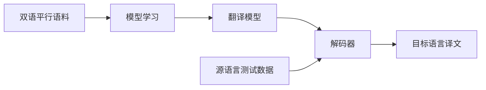

本文为《自然语言处理》课程中“绪论”一讲的整理。

自然语言处理（Natural Language Processing, NLP）研究如何让计算机处理人类的语言。它既是一门工程学科，也是一门交叉学科：向上要回答“机器能否理解语言”，向下要落成翻译、检索、问答等具体系统。

本讲先厘清语言与语言学的基本概念，再回顾 NLP 的发展脉络，随后铺开它的研究内容、基本问题与困难，最后落到理性主义与经验主义两种研究方法。

<!-- more -->

## 什么是 NLP

### 语言与自然语言

语言是人类行为的基本方面，是心智的载体，也是人与人之间交流的重要媒介。语言可以分为两支：

- **自然语言（Natural Language）**，即人类语言（NLP 的研究对象）；
- **结构化语言（Structured Languages）**，如世界语（Esperanto）与各种编程语言。

语言之所以值得用计算手段去研究，是因为“理解”本身就是一件不容易的事：同一串声音或文字，听话者能否解析出意义，取决于其掌握的语言知识。例如，在狗的耳中，无论主人如何措辞，听到的都是一连串无差别的音节。

按照形态学，自然语言可以分为下面几类：

- **分析语（Analytic Languages）**：每个单词几乎只由一个语素组成。单词几乎没有形态变化。单词的语法类别通过语序和虚词来表示。典型代表是汉语和越南语。分析语的一个极端是孤立语，即每个单词只有一个语素
- **综合语（Synthetic Languages）**：单词主要由词根语素附加若干语素来构成。根据语素是否明显可分，综合语又分为两类：
   - **屈折语（Inflected/Fusional Languages）**：融合后的语素难以区分，通常包含大量不规则变化单词。
   - **黏着语（Agglutinative Languages）**：融合后的语素明显可分，形态通常较为规整。典型代表是日语、韩语和土耳其语。

### 图灵测试与所谓智能

讨论“机器能否理解语言”，通常从**图灵测试（Turing Test）** 说起。Alan Turing 在 1950 年提出：与其追问“机器能否思考”，不如设计一个可操作的判据——测试中包含两名人类（其中一名充当审问者）与一台计算机，审问者通过电传打字机向另外两方提问，据此判断哪一方是机器。

图灵的洞见在于：**能否理解并生成语言，可以作为智能的标志**。沿着这一思路，可以把智能分成三个层次：

|   层次   |        能力        |
| :------: | :----------------: |
| 计算智能 |      能存会算      |
| 感知智能 | 能听会说、能看会认 |
| 认知智能 |    能理解会思考    |

今天（21 世纪早期）的 NLP 之所以被视为“人工智能皇冠上的明珠”，正是因为它试图攻克最高层的**认知智能**：让机器不仅识别语言，还能真正理解与思考。

### 发展历程

- 1940–1969：早期探索。
- 1970–1992：基于人工构建符号的 NLP，形式化程度不断提高。
- 1993–2012：统计与概率 NLP，随后发展为更通用的监督式机器学习 NLP。
- 2013 至今：深度学习与人工神经网络，以及无监督或自监督 NLP、强化学习。

2022 年以后，NLP 进入大语言模型（LLM）阶段。

### 相关学科

自然语言处理并不是孤立的名词，它常与其他学科概念交织。

| 学科                                                | 说明                                                                                                                           |
| --------------------------------------------------- | ------------------------------------------------------------------------------------------------------------------------------ |
| 语言学（linguistics）                               | 对语言的科学研究，研究语言的本质、结构和发展规律；语音和文字是语言的两个基本属性。                                             |
| 语音学（phonetics）                                 | 研究人类发音特点，特别是语音发音特点，并提出各种语音描述、分类和转写方法的科学；又可细分为发音语音学、声学语音学和听觉语音学。 |
| 计算语言学（Computational Linguistics, CL）         | 通过建立形式化的计算模型来分析、理解和生成自然语言的学科；与内容接近的 NLP 相比，它更侧重基础理论和方法的研究。                |
| 自然语言理解（Natural Language Understanding, NLU） | 探索人类语言能力和语言思维活动的本质，研究模仿人类语言认知过程的处理方法与实现技术。                                           |
| 自然语言处理（Natural Language Processing, NLP）    | 研究如何利用计算机技术对语言文本进行处理和加工，内容包括对词法、句法、语义和语用等信息的识别、分类、提取、转换和生成。         |

从学科史看，**计算语言学**在 20 世纪 60 年代形成相对独立的学科；**自然语言处理**则在 20 世纪 80 年代面向计算机网络和移动通信，从系统实现和语言工程的角度开展研究。

## NLP 的研究内容

### 研究方向一览

按照应用目标划分，NLP 的研究内容广义上包括：

| 研究方向                                                    | 说明                                                                                                                                         |
| ----------------------------------------------------------- | -------------------------------------------------------------------------------------------------------------------------------------------- |
| 机器翻译（Machine Translation, MT）                         | 实现一种语言到另一种语言的自动翻译，应用如文献翻译、网页辅助浏览。机器翻译至今仍不完美。                                                     |
| 信息检索（Information Retrieval, IR）                       | 也称情报检索，即利用计算机系统从大量文档中找到符合用户需要的相关信息。面对每天数以万计增长的网页，只有极少量信息被有效利用。                 |
| 自动文摘（Automatic Summarization / Automatic Abstracting） | 将原文档的主要内容或某方面的信息自动提取出来，形成摘要或缩写；与观点挖掘（Opinion mining）密切相关，应用于电子图书管理、情报获取等。         |
| 问答系统（Question-Answering System）                       | 通过理解人提出的问题，利用自动推理等手段在知识资源中求解并作出回答；若与语音、多模态、人机交互技术结合，即构成**人机对话系统**。             |
| 信息过滤与信息抽取                                          | 前者自动识别并过滤满足特定条件的文档，后者从指定文档或海量文本中抽取出用户感兴趣的信息，如实体关系抽取、社会网络分析，以及**命名实体识别**。 |
| 文档分类与情感分类                                          | 前者又称文本自动分类或信息分类，按一定标准对文档自动归类；后者判定文本的情感倾向。应用于图书管理、情报获取、网络内容监控等。                 |
| 文字编辑与自动校对、语言教学、文字识别                      | 自动校对对拼写、用词乃至语法和格式进行检查与编排，应用于排版、印刷、书籍编撰；文字识别又称**光学字符识别**（OCR）。                          |
| 语音识别（Automatic Speech Recognition, ASR）               | 将输入语音信号自动转换成书面文字，应用于人机通讯和语音翻译等，其难点在于大量存在的同音词、近音词、集外词与口音。                             |
| 语音合成与说话人识别                                        | 前者（TTS）将书面文本转成语音表征，用于朗读系统与语音接口；后者对言语样品做声学分析，据此确定或验证说话人身份，应用于信息安全与防伪。        |
| 视觉-语言（Vision-Language）                                | 包括图像描述、视频描述、视觉问答、视觉常识推理等。                                                                                           |

### 语言的基本难题

把 NLP 的基本问题对应到语言学的五个层面：

- **形态学（Morphology）**：研究词由词素（morphemes）构成的问题，涉及单词识别与汉语分词。词素包括词根、前缀、后缀、词尾，例如“老虎 ← 老 + 虎”、“图书馆 ← 图 + 书 + 馆”以及 *re + ex + port → reexport*。
- **句法（Syntax）**：研究句子结构成分之间的相互关系与组句规则。为什么一句话可以这么说也可以那么说？
- **语义（Semantics）**：研究如何由词义与句法作用推导语句的意义。
- **语用（Pragmatics）**：研究不同上下文中语句的应用及语境对理解的影响。
- **语音（Phonetics）**：研究语音特性、描述、分类与转写。

这些层面共同带来了 NLP 的核心困难——**歧义**。歧义可细分为词法歧义（如“自动化研究所取得的成就”的两种切分）、词性歧义（*Time flies like an arrow*）、结构歧义（*I saw a man with a telescope*）、语义歧义（一词多义与隐喻）、语音歧义（《施氏食狮史》）以及多音字与韵律歧义（“小心地滑”）。

值得一提的是，结构歧义的数量会随句子变长而爆炸式增长：英语中介词短语（PP）的附着方式组合数由**开塔兰数**给出，$n$ 为句子中介词短语的个数：

<!-- C_n=\binom{2n}{n}\frac{1}{n+1} -->

$$C_n=\frac{(2n)!}{n!\ n!\ (n+1)}$$

除歧义外，NLP 还要面对大量**未知语言现象**——新词、人名、地名、术语，旧词的新含义（躺平、吃瓜），以及“被涨工资”、“很中国”这类新用法新句型。归纳起来，有四个根本困难：

1. **普遍存在的不确定性**：词法、句法、语义、语用和语音各个层面都有；
2. **未知语言现象的不可预测性**：新的词汇、术语、语义和语法无处不在；
3. **始终面临的数据不充分性**：有限的语言集合永远无法涵盖开放的语言现象；
4. **语言知识表达的复杂性**：语义知识模糊且关联错综复杂，难以用常规方法有效描述。

### 两种研究方法

面对上述困难，NLP 形成了两条研究路线。

**理性主义**主张通过研究一些特殊的语句或语言现象来认识人的语言能力，这些语句往往在实际应用中并不常见。其求解思路是**基于规则的分析方法建立符号处理系统**：开发规则库（如 `N + N -> NP`）、标注词典（如 `#工作, N(uc); V;`）、设计归约/推导/歧义消解算法，最终由**知识库 + 推理系统**构成 NLP 系统，理论基础是 Chomsky 的文法理论。

**经验主义**则偏重于对大规模语言数据中人们实际使用的普通语句进行统计。其思路是**基于大规模真实语料建立计算方法**：收集与标注大规模真实数据（关注真实性、代表性、标注信息），建立统计模型（关注模型的复杂性、有效性与参数训练），最终由**语料库 + 统计模型**构成 NLP 系统，理论基础是统计学、信息论与机器学习。

以机器翻译为例对比两条路线。以 `There is a book on the desk.` 译成汉语为例，规则方法先做词法分析，再建立英语**句法树**。随后利用**转换规则**把英语结构转换成汉语结构（例如把介词短语前移），最后依据短语结构与词典生成译文——“在桌子上有一本书”。

而数据驱动的方法（如统计机器翻译 SMT 与神经机器翻译 NMT）则从**双语平行语料**出发，经模型学习得到翻译模型，再由解码器结合源语言测试数据输出目标语言译文：

其中统计方法可以从贝叶斯公式推导：设源语言句子 $E=e_1^m$、目标语言句子 $C=c_1^l$，则

$$P(C\mid E)=\frac{P(C)P(E\mid C)}{P(E)},\qquad \hat C=\arg\max_C P(C)P(E\mid C).$$

式中 $P(C)$ 由**语言模型**（LM）估计，$P(E\mid C)$ 由**翻译模型**（TM）估计，解码器的任务就是快速搜索使二者乘积最大的候选译文。

两条路线并非对立。规则方法贡献形式语言、语法理论、词法理论与推理方法，统计方法贡献数学模型、信息论、机器学习与搜索算法，二者共享一个知识库。
