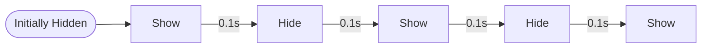

本文主要分析了游戏《明日方舟：终末地》（简称《终末地》）的 UI 设计原理与风格，旨在为复现这样的 UI 提供参考。

## 美工文化

~~鹰角网络简直是平面设计的神！~~ 要想谈论这个游戏作品的 UI 设计，我们得先从它背后的游戏公司说起。鹰角网络在美工领域一直是行业的一个标杆，并且树立了自己的美工文化。

它早年发行的游戏《明日方舟》在 UI 设计上就已经展现了很高的水准，在我看来属于业内第一梯队的水平，丝毫不逊色于当时国内其他知名游戏公司的作品。而《终末地》作为 2026 年发行的续作，在 UI 设计方面与《明日方舟》具有相似之处，在后续章节中我们会详细对其展开讨论。

除了 UI 设计，鹰角网络在平面设计和视觉动效方面也有着非常高的水准，这里主要评价的是游戏的 PV 和 EP 视频。以较早一批发布的“莱茵生命”相关 PV 为代表，《明日方舟》的很多视频都在视觉设计方面可圈可点，并且其设计理念也在《终末地》中有所体现，我们后面也会进行分析。

整体而言，与其说我们在分析《终末地》的 UI 设计，不如说我们其实是在分析鹰角网络的整个美工文化的缩影。本文主要着重于解决三个问题：哪里设计得好？为什么好？是怎么做的？

## 整体感觉

需要注意的是，并非所有前端设计都能借鉴《终末地》的 UI 设计风格。当且仅当我们希望 UI 呈现以下特性时，才可考虑借鉴：

- 具有未来前沿科技感
- 具有视觉冲击力和充分的动效

## 特性详解

为了便于复现，我们将《终末地》的 UI 特性分解为了若干个明确的特性项目。

### 快速闪动

快速闪动指的是 UI 元素在不更改其他任何变换属性的情况下，仅通过在极短时间内多次切换元素的隐藏或显示状态，以起到吸引用户注意的作用的操作。

快速闪动在《终末地》的 UI 中使用的极为频繁，所以本文将其作为第一个核心特性进行介绍。

在《终末地》中，快速闪动常作为直接“出现” UI 元素的替代方案，其典型参数和动画流程是：

即，闪烁半周期长度为 0.1 秒，闪烁周期数为 2 次。

相比其他的“出现”方式，例如渐入、飞入、缩放等，快速闪动的优势在于，其能够以最短的时间和最少的副作用干扰，最大化地吸引用户的注意力。

### 强调色块

在《终末地》中，主要采用的强调色是亮黄色，背景色是黑色。更泛化地讲，强调色是与背景色的对比度很高的颜色。

强调色块指的是在矩形形状中填充强调色作为背景的用法。它大致有两类用途：静态强调色块和动态强调色块。

静态强调色块指的是在原先采用背景色作为背景的块状 UI 元素中，将背景改换为强调色的操作。它主要被使用在标签页项目的选中或聚焦状态中。用户可以通过强调色块快速识别当前选中的标签页，从而提高用户的操作效率。

动态强调色块指的是在需要引起用户视觉注意的区域，使用强调色块的进入、退出、滑动、掠过等动效来吸引用户的注意。例如，当玩家的任务目标完成后，游戏界面的任务名称悬浮显示区域会从左到右快速滑入和滑出一个强调色块，滑出的同时擦除名称文本，以此提示任务的完成。尤其是对于文本的变化提示，若希望引起用户的注意，则设置动态强调色块是一个非常有效的手段。

通常而言，强调色块可以与快速闪动有机进行结合。

### 激进缓动

鹰角网络尤其喜欢使用一些较为“激进”的缓动函数进行过渡，例如 easeOutQuad。它们的特点是在缓动开始和结束阶段的斜率差距极大（故称“激进”）。

### 几何纹理

纯色纹理的 UI 元素往往显得过于单调。要想实现科技感的 UI，纹理背景通常会使用基础几何形状的组合。

例如，密集网格纹理背景是最常用也是最易于使用的一种几何纹理。它通常由大量的等距排列的点或线组成，形成一种网格状的视觉效果。

若对几何纹理有更高的追求，可以尝试使用类似等高线的几何纹理，它不再拘泥于使用直线来绘制，而是采用了层叠的若干间距相等的曲线来形成纹理背景。它的视觉效果更为复杂，能够给人一种更高阶的科技感。

### 克制圆角

《终末地》和《明日方舟》的 UI 中极少使用圆角，而大部分的 UI 元素都呈矩形。这一点是表现未来科技感的一个关键因素，因为棱角分明的矩形元素在经验上更容易让人联想到科技相关的事物，而圆角则更容易让人联想到生活化的、较柔和的事物。

《终末地》中唯一频繁使用圆角 UI 的地方是长按钮的两端，它们采用了较大的圆角半径。

### 光标跟随

在 PC 端的《终末地》终端界面中，随着玩家鼠标的移动，终端的 UI 的 3D 旋转角度会随之发生变化。这种变化的方向是向光标“亲和”的方向。例如，当鼠标移动到终端的左上角时，终端整体的 UI 会呈现出左上角视深更深、右下角视深更浅的 3D 旋转效果，感觉好像光标到终端平面的连线始终能和该平面垂直一样。

在移动端，这种光标跟随效果则改用了陀螺仪进行实现。这种变化方向遵循“来拒去留”原则，呈现为抑制陀螺仪检测到的角度变化的行为特征。例如，当玩家手机逆时针倾斜（左侧短边向下翻转、右侧短边向上翻转时），终端的 UI 也会整体向左侧移动，感觉好像这个 UI 并没有因为倾斜而在同一观测视野中发生位置变化一样。
