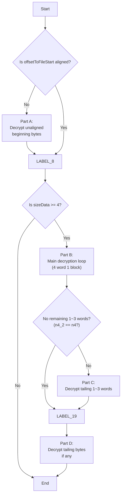

本文记录了我对 Unity 游戏[《明日方舟：终末地》](https://endfield.hypergryph.com/)（简称《终末地》）全面测试版本中的 **PCK 文件**的逆向工程过程。

<!-- more -->

## 前言

### 关于 PCK 文件

在上一篇文章  中，我们已经成功从 CHK 文件中提取出了大量资源文件，其中就包括一些 PCK 文件。

**PCK 文件**是 [AudioKinetic](https://www.audiokinetic.com/) 音频技术公司（简称 Ak 公司）所开发的一种 **Wwise 音频容器**文件。PCK 指的是单词 PaCKage。

《终末地》中的**语音（Voice）、音乐（Music）和音效（SFX）** 资源均使用 PCK 文件存储。分析 PCK 文件有助于我们从游戏中提取出各类音频资源。

### 初步分析

以 OS Win 版本的游戏为例，所有 PCK 文件均位于 VFS 的 `Data/Audio/PCK/Windows` 目录中。目录的内容如下所示：

```
Data/Audio/PCK/Windows/
|- Chinese
|  |- default_chinese_banks.pck
|  |- default_chinese_stream.pck
|- English
|  |- default_english_banks.pck
|  |- default_english_stream.pck
|- Initial
|  |- init_banks.pck
|  |- init_stream.pck
|- Japanese
|  |- default_japanese_banks.pck
|  |- default_japanese_stream.pck
|- Korean
|  |- default_korean_banks.pck
|  |- default_korean_stream.pck
|- Main
   |- default_banks.pck
   |- default_stream_0.pck
   |- default_stream_1.pck
```

可以发现，PCK 文件的命名规则是清晰的。语音文件按照语言划分为 4 个目录（Chinese、English、Japanese 和 Korean）。此外，还有 Initial 和 Main 目录，存储游戏的初始音频资源和主要音频资源。每个目录下，均包含一个**音频包（Banks）** 的 PCK 文件和至少一个**音频流（Stream）** 的 PCK 文件。

常规的 PCK 文件，其**魔数**为 `AKPK`。但是，游戏中所有 PCK 文件的开头均为 `:)xD` ~~，是两个可爱的表情符号~~。经过简单分析，我们能够轻易确认这不是简单的魔数替换，这就意味着 **PCK 文件经过了加密处理**。

本文的主要部分将会介绍 PCK 文件的解密方式及其破解流程。

## 对音频库进行反编译

我希望先通过对**音频加载**的代码逻辑的反编译，来了解 PCK 文件的解密方式。

### 意外收获的符号信息

我们可以找到疑似与音频有关的**库**：

- OS Win & CN Win：`EndfieldTBeta2_Data/Plugins/x86_64/AkSoundEngine.dll`（3.19 MB）
- OS Android & CN Android：`lib/arm64-v8a/libAkSoundEngine.so`（37.2 MB）

首先令人疑惑的是，为什么不同操作系统的同一个库文件的大小会有如此大的差异？经过 IDA Pro 检视发现，**Android 版本**的库文件中留存了大量的 **DWARF 符号信息**，而 Windows 版本的库文件则经过了剥离处理。Android 版本的符号信息的遗留可能是开发者疏忽所致，利用这些符号信息可以大幅降低音频库的逆向难度~~，没有这个符号信息的话逆向会非常困难~~。

### 详细分析文件载入函数

我们能够在函数表中找到 `CAkFilePackageLowLevelIO<CAkDefaultIOHookDeferred, CAkFilePackage>::_LoadFilePackage` 函数，它的功能是**读取并解析指定的 PCK 文件**（尤其是头部数据）。让我们分块分析该函数的反编译代码：

#### 函数签名与变量定义

该函数传入了文件包名称、Reader 和 Reader 优先级，作为输入参数；还有一个输出参数用于传递构造好的 `CAkFilePackage` 对象的指针；而返回值指示是否加载成功。

```cpp
AKRESULT_0 __fastcall CAkFilePackageLowLevelIO<CAkDefaultIOHookDeferred, CAkFilePackage>::_LoadFilePackage(
    CAkFilePackageLowLevelIO<CAkDefaultIOHookDeferred, CAkFilePackage> *this,
    const AkOSChar *in_pszFilePackageName,
    AkFilePackageReader *in_reader,
    AkPriority in_readerPriority,
    CAkFilePackage **out_pPackage)
```



```cpp
unsigned int in_readerPriority_1, n8, n8_1, v15, v16, v22, v37, v38;
int v10, v18, n1263553345, m_uRefCount, m_uRefCount_1;
size_t n8_2;
unsigned __int64 v14;
void *in_pMemAddress;
AK::IAkStdStream *m_pStream, *m_pStream_1, *m_pStream_2;
AkUInt32 in_uAlignment, IDFromString, uSizeRead_1, uSizeRead_2, uSizeRead_4, uSizeRead_3, uSizeRead;
AkUInt8 *m_pToRelease_1, *m_pToRelease;
CAkFilePackage *v25, **out_pPackagea_1, *v46, *v48, **out_pPackagea;
__int64 v30, n8_3, v53;
const void *v33;
CAkFilePackageLowLevelIO<CAkDefaultIOHookDeferred, CAkFilePackage> *thisa_1, *thisa;
const char *Could_not_read_package__or_package_is_invalid;
AKRESULT_0 AKRESULT::AK_Fail, AKRESULT::AK_Success;
CAkFilePackageLUT *p_lut;
const AkOSChar *CurrentLanguage;
```



#### Step 1：获取流对齐要求

函数首先进行内存对齐有关的计算，以确保满足某些特定的对齐要求。



```cpp
// [Step 1] Gets stream alignment requirements
in_readerPriority_1 = in_readerPriority;
v53 = *(_ReadStatusReg(TPIDR_EL0) + 40);
v10 = (*(in_reader->m_pStream->_vptr$IAkStdStream + 6))(in_reader->m_pStream);
n8 = 8;
n8_1 = 8;
if ((2 * v10) >= 9)
  n8_1 = 2 * (*(in_reader->m_pStream->_vptr$IAkStdStream + 6))(in_reader->m_pStream);
n8_2 = n8_1;
v14 = &out_pPackagea - ((n8_1 + 15LL) & 0x1FFFFFFF0LL);
if (8 % (*(in_reader->m_pStream->_vptr$IAkStdStream + 6))(in_reader->m_pStream))
{
  v15 = (*(in_reader->m_pStream->_vptr$IAkStdStream + 6))(in_reader->m_pStream);
  v16 = (*(in_reader->m_pStream->_vptr$IAkStdStream + 6))(in_reader->m_pStream);
  v14 = v14 / v16 * v16 + v15;
  n8 = (*(in_reader->m_pStream->_vptr$IAkStdStream + 6))(in_reader->m_pStream);
}
```



#### Step 2：预读取文件的前 8 Bytes

随后，分配临时内存，并读取 PCK 文件的前 8 Bytes 数据。这里的 `AK::MemoryMgr::Malign` 函数就是用于分配内存的。

```cpp
// [Step 2] Reads first 8 Bytes
in_pMemAddress = AK::MemoryMgr::Malign(7, n8_2, 0x10u);
if ((*(in_reader->m_pStream->_vptr$IAkStdStream + 7))(
        in_reader->m_pStream,
        in_pMemAddress,
        n8,
        1,
        in_readerPriority_1,
        &uSizeRead,
        0.0) != 1 ||
    uSizeRead <= 7)
{
  if (in_reader->m_pStream)
    (*(in_reader->m_pStream->_vptr$IAkStdStream + 2))(in_reader->m_pStream);
  in_reader->m_pStream = 0;
  AK::MemoryMgr::Free(7, in_pMemAddress);
  Could_not_read_package__or_package_is_invalid = "Could not read package, or package is invalid";
  goto LABEL_20; // Fail
}
```

#### Step 3：检查预读取结果

然后，检查读取到的 8 Bytes 的内容是否满足以下条件：

- 前 4 Bytes（`*v14`）是**魔数**，它的无符号整数值应该等于 `1148725562` 或者 `1263553345`；
- 后 4 Bytes（`v18`）必须非零，可能是**头部大小**。

这里的 `1148725562` 对应字符串 `:)xD`，而 `1263553345` 对应字符串 `AKPK`。

```cpp
// [Step 3] Checks first 8 Bytes
memcpy(v14, in_pMemAddress, uSizeRead);
AK::MemoryMgr::Free(7, in_pMemAddress);
v18 = *(v14 + 4);
if (!v18 ||
    (n1263553345 = *v14, *v14 != 1148725562) // ":)xD"
        && n1263553345 != 1263553345)        // "AKPK"
{
  if (in_reader->m_pStream)
    (*(in_reader->m_pStream->_vptr$IAkStdStream + 2))(in_reader->m_pStream);
  AKRESULT::AK_Fail = AKRESULT::AK_Fail_0;
  in_reader->m_pStream = 0;
  return AKRESULT::AK_Fail;
}
```

#### Step 4：分配头部数据的内存

接下来，根据头部大小 `v18` 来分配内存，以便后续读取完整的头部数据。这里的“头部大小”是不包括之前读取的 8 Bytes 的。



```cpp
// [Step 4] Allocates memory for the full header
m_pStream = in_reader->m_pStream;
thisa = this;
in_uAlignment = (*(m_pStream->_vptr$IAkStdStream + 6))(m_pStream);
v22 = (v18 + in_uAlignment + 7) / in_uAlignment * in_uAlignment;
m_pToRelease_1 = AK::MemoryMgr::Malign(15, v22 + 104, in_uAlignment);
if (!m_pToRelease_1)
{
  *out_pPackage = 0;
  if (in_reader->m_pStream)
    (*(in_reader->m_pStream->_vptr$IAkStdStream + 2))(in_reader->m_pStream);
  in_reader->m_pStream = 0;
  Could_not_read_package__or_package_is_invalid = "Could not create file package";
LABEL_20:
  AKRESULT::AK_Fail = AKRESULT::AK_Fail_0;
  AK::Monitor::PostString(
      Could_not_read_package__or_package_is_invalid,
      AK::Monitor::ErrorLevel::ErrorLevel_Error,
      0,
      0xFFFFFFFFFFFFFFFFLL,
      0,
      0);
  return AKRESULT::AK_Fail;
}
m_pToRelease = m_pToRelease_1;
out_pPackagea = out_pPackage;
```



#### Step 5：构造 `CAkFilePackage` 对象

紧接着，构造一个 `CAkFilePackage` 对象，并初始化其成员变量。值得注意的是，如果魔数不是 `AKPK`，则 `m_isCiphered` 为真，意味着这个 PCK 文件已被加密。

```cpp
// [Step 5] Constructs CAkFilePackage object
v25 = &m_pToRelease_1[v22];
IDFromString = AK::SoundEngine::GetIDFromString(in_pszFilePackageName);
v25->_vptr$CAkFilePackage = vptr_CAkFilePackage;
v25->pNextItem = 0;
CAkFilePackageLUT::CAkFilePackageLUT(&v25->lut);
v25->m_reader.m_pStream = 0;
v25->m_pToRelease = m_pToRelease;
m_pStream_1 = in_reader->m_pStream;
v25->m_uPackageID = IDFromString;
v25->m_uHeaderSize = v18 + 8;
v25->m_isCiphered = n1263553345 != 1263553345; // True if magic != "AKPK"
out_pPackagea_1 = out_pPackagea;
v25->m_reader.m_pStream = m_pStream_1;
m_pStream_2 = in_reader->m_pStream;
v25->m_uRefCount = 1;
v30 = (*(m_pStream_2->_vptr$IAkStdStream + 4))(m_pStream_2);
```

#### Step 6：读取完整的头部数据

然后，读取完整的头部数据，写入到之前分配的连续内存中。仅仅是读取而已，还没有进行解密。



```cpp
// [Step 6] Reads the rest of the package
uSizeRead_1 = uSizeRead;
uSizeRead_2 = *(v14 + 4);
v25->m_hFile = *(v30 + 16);
*out_pPackagea_1 = v25;
if (uSizeRead_1 >= 9)
{
  v33 = (v14 + 8);
  uSizeRead_4 = uSizeRead_1 - 8;
  memcpy(m_pToRelease + 8, v33, uSizeRead_1 - 8);
  if (uSizeRead_4 <= uSizeRead_2)
    uSizeRead_3 = uSizeRead_4;
  else
    uSizeRead_3 = uSizeRead_2;
  n8_3 = uSizeRead_3 + 8;
  v37 = uSizeRead_2 + ~uSizeRead_3 + (*(in_reader->m_pStream->_vptr$IAkStdStream + 6))(in_reader->m_pStream);
  v38 = v37 / (*(in_reader->m_pStream->_vptr$IAkStdStream + 6))(
                  &in_reader->m_pStream->_vptr$IAkStdStream,
                  in_reader->m_pStream);
  uSizeRead_2 = (*(in_reader->m_pStream->_vptr$IAkStdStream + 6))(
                    &in_reader->m_pStream->_vptr$IAkStdStream,
                    in_reader->m_pStream) *
                v38;
  out_pPackagea_1 = out_pPackagea;
  thisa_1 = thisa;
  if (!uSizeRead_2)
    goto LABEL_31; // Goto step 7
LABEL_29:
  if ((*(in_reader->m_pStream->_vptr$IAkStdStream + 7))(
          in_reader->m_pStream,
          &m_pToRelease[n8_3],
          uSizeRead_2,
          1,
          in_readerPriority_1,
          &uSizeRead,
          0.0) != 1 ||
      uSizeRead < uSizeRead_2)
  {
  LABEL_38:
    v46 = *out_pPackagea_1;
    m_uRefCount = (*out_pPackagea_1)->m_uRefCount - 1;
    (*out_pPackagea_1)->m_uRefCount = m_uRefCount;
    if (!m_uRefCount)
      (*(v46->_vptr$CAkFilePackage + 2))(v46);
    return AKRESULT::AK_Fail_0;
  }
  goto LABEL_31; // Goto step 7
}
n8_3 = 8;
thisa_1 = thisa;
if (uSizeRead_2)
  goto LABEL_29;
```



#### Step 7：解密头部数据并建立查找表

最关键的一步来了。如果魔数不是 `AKPK`，则调用 `HGCipherHelper::DecipherInplace` 函数**对读取到的头部数据进行解密**。解密完成后，调用 `CAkFilePackageLUT::Setup` 函数来建立文件包的查找表（LUT）。

```cpp
// [Step 7] Deciphers package if needed and then sets up LUT
LABEL_31:
if (n1263553345 != 1263553345) // If magic != "AKPK"
  HGCipherHelper::DecipherInplace(m_pToRelease + 12, uSizeRead_2, uSizeRead_2 - 4, 0);
AKRESULT::AK_Success = CAkFilePackageLUT::Setup(&(*out_pPackagea_1)->lut, m_pToRelease, uSizeRead_2 + 8);
```

#### Step 8：后续的收尾工作

最后，进行一些后续的处理工作，例如注册语言变更的回调函数等。如果一切顺利，函数返回 Success；否则进行清理并返回 Fail。



```cpp
// [Step 8] Performs post processing
if (AKRESULT::AK_Success == AKRESULT::AK_Success_0)
{
  if (thisa_1->m_bRegisteredToLangChg)
  {
  LABEL_37:
    p_lut = &(*out_pPackagea_1)->lut;
    CurrentLanguage = AK::StreamMgr::GetCurrentLanguage();
    return CAkFilePackageLUT::SetCurLanguage(p_lut, CurrentLanguage);
  }
  if (AK::StreamMgr::AddLanguageChangeObserver(
          CAkFilePackageLowLevelIO<CAkDefaultIOHookDeferred, CAkFilePackage>::LanguageChangeHandler,
          thisa_1) == AKRESULT::AK_Success_0)
  {
    thisa_1->m_bRegisteredToLangChg = 1;
    goto LABEL_37;
  }
  goto LABEL_38; // Fail
}
AKRESULT::AK_Fail = AKRESULT::AK_Success;
v48 = *out_pPackagea_1;
m_uRefCount_1 = (*out_pPackagea_1)->m_uRefCount - 1;
(*out_pPackagea_1)->m_uRefCount = m_uRefCount_1;
if (!m_uRefCount_1)
  (*(v48->_vptr$CAkFilePackage + 2))(v48);
return AKRESULT::AK_Fail;
```



### 详细分析解密函数

从上面的 `_LoadFilePackage` 函数的分析中，我们可以确认 PCK 文件的**头部数据解密**是通过 `HGCipherHelper::DecipherInplace` 函数完成的。下一步，我们需要对该函数进行详细分析。

#### 函数签名与变量定义

首先，我们找到该函数的签名：

```cpp
void __fastcall HGCipherHelper::DecipherInplace(
        AkUInt8 *pData,
        AkUInt32 seed,
        AkUInt32 sizeData,
        AkUInt32 offsetToFileStart)
```

根据参数传递关系，可以整理得到参数之间的关系如下：

| 参数名称            | 调用者 `_LoadFilePackage` 所传递的值 |
| :------------------ | :----------------------------------- |
| `*pData`            | `m_pToRelease + 12`                  |
| `seed`              | `uSizeRead_2`                        |
| `sizeData`          | `uSizeRead_2 - 4`                    |
| `offsetToFileStart` | `0`                                  |

据此，我们可以得知，**被解密的数据是从整个文件的第 12 Byte 开始的**，长度为头部大小减去 4 Bytes（为什么不是 12 Bytes？因为“头部大小”不包括文件的前 8 Bytes）。解密所用的种子是头部大小本身。

通过函数的返回值（`void`）以及函数的名称，我们可以知道该函数的作用是**就地解密**，即直接在传入的内存缓冲区（`pData`）中对数据进行解密处理。



```cpp
__int64 n2, sizeData_1, v9, n4, n4_2, n4_3, v23, v25, v29, v41, v46, vars0;
unsigned int v5, v22, v24, v26;
AkUInt32 n4_1;
int8x16_t v12, *pData_1, v18, v20, *v31, *v32, v34, v35, v36;
int32x4_t v13, v14, v17, v19;
AkUInt8 *v21, v27, *v42;
unsigned __int64 n0x20, n0x20_1, v33, v39;
int8x8_t *v37, *v38, v40;
char *v43, v44;
int v45;
```



#### 函数体概览

将解密函数的主要框架进行整理后，可以得到如下的代码结构：

```cpp
// Outline of HGCipherHelper::DecipherInplace

n2 = offsetToFileStart & 3;
v5 = seed + (offsetToFileStart >> 2);
v46 = *(_ReadStatusReg(TPIDR_EL0) + 40);

if ((offsetToFileStart & 3) != 0) // If offsetToFileStart unaligned
{
  // [Part A] Decrypts unaligned beginning bytes
  // ...
    goto LABEL_8;
  // ...
}
else
{
LABEL_8:
  n4_1 = sizeData >> 2; // Calculate words count (divide sizeData by 4)
  v9 = sizeData & 3;    // Calculate tailing bytes count
  if (sizeData < 4)
    goto LABEL_19;
  n4 = n4_1 <= 1 ? 1 : n4_1;
  if (n4 >= 4)
  {
    n4_2 = n4 & ~0xCFFFFFF3; // Calculate 4-words blocks count
    // [Part B] Main decryption loop
    // ...
    if (n4_2 == n4)
    {
      LABEL_19:
      // [Part D] Decrypts tailing 1~3 bytes
      // ...
    }
  }
  else
  {
    n4_2 = 0;
  }

  // [Part C] Decrypts tailing 1~3 words
  // ...
  goto LABEL_19;
}
```

可以绘制成流程图：



不难发现，函数将整个解密过程分为 4 个部分：

- **Part A**：解密起始位置未对齐的 Bytes；
- **Part B**：解密对齐的 4-Words 块；
- **Part C**：解密尾部残余的 Words；
- **Part D**：解密尾部残余的 Bytes。

接下来，我们将逐步分析这三部分的解密逻辑。

#### Part A：解密起始位置未对齐的 Bytes

对**起始位置未按照 4 Bytes 对齐**的字节进行解密处理之前，先生成了一个**异或密钥** `v45`。该密钥的生成方式是，使用初始混淆常数 `0x9C5A0B29` 和质数 `81861667`（`0x4E11C23`）针对 `seed + (offsetToFileStart >> 2)` 进行了多次**乘法和异或运算（XOR-Mul）**。

随后，计算 `n2`，即起始位置相对于 4 Bytes 对齐位置的偏移量。根据该偏移量，使用 `v45` 对起始的 1 至 3 个字节进行解密。

最后，更新 `sizeData`、数据指针和变量 `v5`，并检查是否还有剩余数据需要解密。如果有，则跳转到标签 `LABEL_8` 继续处理。

Part A 的代码如下所示：

```cpp
// Code of Part A

v45 = 81861667 * (
  (81861667 * (
    (81861667 * (
      (81861667 * (
        (seed + (offsetToFileStart >> 2)) ^ 0x9C5A0B29)
      ) ^ ((seed + (offsetToFileStart >> 2)) >> 8))
    ) ^ ((seed + (offsetToFileStart >> 2)) >> 16)) 
  ) ^ ((seed + (offsetToFileStart >> 2)) >> 24)
);

// n2 = offsetToFileStart & 3;
sizeData_1 = (4 - n2);
*pData ^= *(&v45 | n2);
if (n2 != 3)
{
  pData[1] ^= *(&retry + (n2 | &v45) + 1);
  if (n2 != 2)
    pData[2] ^= *(&retry + (n2 | &v45) + 2);
}
sizeData -= sizeData_1;
if (sizeData != 0 && sizeData >= sizeData_1)
{
  pData += sizeData_1;
  ++v5;
  goto LABEL_8;
}
```

#### Part B：解密对齐的 4-Words 块

在 Part B 的代码中，我们会接触到 **Arm NEON SIMD 指令集**。它允许处理器在一个指令（Single Instruction）周期内同时对多个数据（Multiple Data）进行运算，从而提升性能。正是由于采用了 NEON 指令集，所以主数据块的解密循环**每次同时处理 16 Bytes（4 Words）** 而不是 4 Bytes。

在阅读 Part B 的代码前，先列出了一些 NEON 指令的简要说明，以供参考：

| 指令          | 用途                                                            |
| :------------ | :-------------------------------------------------------------- |
| `vdupq_n_s32` | Duplicate：复制一个 32 位整数到一个 128 位向量的所有 4 个通道中 |
| `vaddq_s32`   | Add：对两个 128 位向量中的每个对应的 32 位整数进行加法运算      |
| `vmulq_s32`   | Multiply：对两个 128 位向量中的每个对应的 32 位整数进行乘法运算 |
| `veorq_s8`    | Exclusive Or：对两个 128 位向量进行按位异或运算                 |
| `vandq_s8`    | And：对两个 128 位向量进行按位与运算                            |
| `vshrq_n_u32` | Shift Right：对 128 位向量中的每个 32 位整数进行逻辑右移操作    |
| `veor_s8`     | Exclusive Or：对两个 64 位向量进行按位异或运算                  |

以下是 Part B 的完整代码：

```cpp
// Code of Part B

// n4_1 = sizeData >> 2;
// n4 = n4_1;
n4_2 = n4 & ~0xC0000003; // Word count, but ignore last 1~3 word, means 4-words aligned count
v12.n128_u64[0] = 0xFF000000FFLL;
v12.n128_u64[1] = 0xFF000000FFLL;
v13 = xmmword_667D0;
v14.n128_u64[0] = 0x400000004LL;
v14.n128_u64[1] = 0x400000004LL;
n4_3 = n4_2;
pData_1 = pData;
v17 = vdupq_n_s32(v5); // Word index
v18 = vdupq_n_s32(0x9C5A0B29);
v19 = vdupq_n_s32(0x4E11C23u);
do
{
  v20 = vaddq_s32(v17, v13);
  n4_3 -= 4; // Process 4 words (16 Bytes) each iter
  v13 = vaddq_s32(v13, v14);
  *pData_1 = veorq_s8(
    *pData_1,
    vmulq_s32(
      veorq_s8(
        vmulq_s32(
          veorq_s8(
            vmulq_s32(
              veorq_s8(
                vmulq_s32(
                  veorq_s8(
                    vandq_s8(v20, v12), v18),
                  v19),
                vandq_s8(vshrq_n_u32(v20, 8u), v12)),
              v19),
            vandq_s8(vshrq_n_u32(v20, 16u), v12)),
          v19),
        vshrq_n_u32(v20, 24u)),
      v19)
  );
  ++pData_1; // Move to next 16 Bytes block
} while (n4_3);
```

从代码中可以知道，Part B 的执行步骤是：

1. **初始化寄存器**：加载常数 `0x9C5A0B29` 和 `0x4E11C23` 到 NEON 寄存器中，以便后续的密钥生成使用；
2. **计算块的数量**：通过 `sizeData >> 2` 计算出数据中包含多少个完整的 4-Words 块，并忽略最后可能剩余的 1~3 Words；
3. **密钥生成与数据解密**：对于每个 4-Words 块，计算其对应的块索引，然后使用 XOR-Mul 算法生成一个 4-Words 的密钥向量，最后将该数据块与密钥向量进行按位异或运算以完成解密；
4. **更新指针和索引**：在每次处理完一个 4-Words 块后，更新数据指针和块索引，继续处理下一个块，直到所有完整的 4-Words 块都被解密。

最关键的一点，**密钥的计算方法是：**

对于**每个 4 Bytes（Word）索引** $I_w = \text{seed} + \text{wordOffset}$，其生成的 4 Bytes **解密密钥** $K_w$ 的计算过程可以表示为（数值精度均为 32 位）：

$$
\begin{align*}
T_0 &= (I_w \land \text{0xFF}) \oplus \text{0x9C5A0B29} \cr
T_1 &= (T_0 \cdot \text{0x4E11C23}) \oplus ((I_w \gg 8) \land \text{0xFF}) \cr
T_2 &= (T_1 \cdot \text{0x4E11C23}) \oplus ((I_w \gg 16) \land \text{0xFF}) \cr
T_3 &= (T_2 \cdot \text{0x4E11C23}) \oplus (I_w \gg 24) \cr
K_w &= T_3 \cdot \text{0x4E11C23}
\end{align*}
$$

这一密钥计算办法无论是对于开头的未进行 4 Bytes 对齐的数据、还是对于后续的数据，都是适用的。

需要指出，$\text{wordOffset}$ 的起始值是 `offsetToFileStart >> 2`。但在这个解密函数中，似乎总传入 `offsetToFileStart = 0`，所以起始的 $\text{wordOffset} = 0$。

#### Part C：解密尾部残余的 Words

经过 Part B 处理后，如果存在**未按照 4 Words 对齐**的尾部 1\~3 Words，则会在 Part C 中对它们进行解密处理。处理完成后，前往 `LABEL_19`（即 Part D）继续处理可能的未对齐的尾部 1\~3 Bytes。

以下给出了 Part C 的代码：

**Part C 代码：**

```cpp
// Code of Part C

v21 = &pData[4 * n4_2]; // Pointer to tailing words
v22 = v5 + n4_2; // Word index of tailing words
v23 = n4 - n4_2; // Tailing words count
do
{
  --v23;
  v24 = (81861667 * (
    (81861667 * (
      (81861667 * (
        v22 ^ 0x9C5A0B29
      )) ^ BYTE1(v22)
    )) ^ BYTE2(v22)
  )) ^ HIBYTE(v22);
  ++v22;
  *v21 ^= 81861667 * v24;
  v21 += 4; // Move to next word (next 4 Bytes)
} while (v23);
goto LABEL_19;
```

#### Part D：解密尾部残余的 Bytes

最后需要处理的是尾部可能剩余的 1\~3 Bytes。这一部分的代码的逻辑存在一些令人费解的分支，但总体思路就是直接使用最后一个残缺 Word 的密钥，按字节对应地、依次地对剩余的 1\~3 Bytes 进行解密。

Part D 的代码如下所示（不必细究）：

```cpp
// Code of Part C

LABEL_19:
  // No more 1~3 remaining words now
  if ((sizeData & 3) == 0) // If no tailing 1~3 Bytes
    return;
  // Still has 1~3 tailing Bytes
  v25 = sizeData & ~0x3; // Next word index after the last 4-words aligned word
  v26 = (
    81861667 * (
      (81861667 * (
        (81861667 * (
          (n4_1 + v5) ^ 0x9C5A0B29)
        ) ^ ((n4_1 + v5) >> 8))
      ) ^ ((n4_1 + v5) >> 16)
    )) ^ ((n4_1 + v5) >> 24
  );
  v27 = pData[v25];
  v45 = 81861667 * v26; // Key
  pData[v25] = v27 ^ (35 * v26); // Decrypt 1 tailing byte
  if (v9 == 1) // If only 1 tailing byte
    return;
  // Still has 2~3 tailing bytes
  n0x20 = v9 - 1;
  if ((v9 - 1) < 8)
  {
    v29 = 1;
    goto LABEL_34; // Finally will return
  }
  // Some code omiitted here...

LABEL_34:
  v41 = v9 - v29; // Remaining tailing bytes count
  v42 = &pData[v29 + v25];
  v43 = &v45 + v29; // Key pointer shift by v29
  do
  {
    v44 = *v43++; // Key pointer shift by 1
    --v41;
    *v42++ ^= v44; // Decrypt single byte
  } while (v41);
  return;
```



```cpp
// The omitted code of Part C, may be dead code?

if (n0x20 >= 0x20)
{
  n0x20_1 = n0x20 & ~0x1FLL;
  v31 = (&vars0 + 5);
  v32 = &pData[v25 + 17];
  v33 = n0x20 & ~0x1FLL;
  do
  {
    v34 = v31[-1];
    v35 = *v31;
    v31 += 2;
    v33 -= 32LL;
    v36 = veorq_s8(*v32, v35);
    v32[-1] = veorq_s8(v32[-1], v34);
    *v32 = v36;
    v32 += 2;
  } while (v33);
  if (n0x20 == n0x20_1)
    return;
  if ((n0x20 & 0x18) == 0)
  {
    v29 = n0x20_1 | 1;
    goto LABEL_34;
  }
}
else
{
  n0x20_1 = 0;
}
v29 = n0x20 & ~0x7LL | 1;
v37 = (&v45 + n0x20_1 + 1);
v38 = &pData[n0x20_1 + 1 + v25];
v39 = n0x20_1 - (n0x20 & ~0x7LL);
do
{
  v40.n64_u64[0] = v37->n64_u64[0];
  ++v37;
  v39 += 8LL;
  v38->n64_u64[0] = veor_s8(v38->n64_u64[0], v40).n64_u64[0];
  ++v38;
} while (v39);
if (n0x20 == (n0x20 & ~0x7LL))
  return;
```



#### 使用 Python 复现解密

在理解了解密算法的逻辑的基础上，我们可以使用 Python 来复现该解密算法的逻辑，直接使用标量运算来解密。以下是一个等效的 Python 实现，它更容易被阅读和理解：

```python
def decipher_inplace(p_data: bytearray, seed: int, size: int, offset_to_file_start: int) -> None:
    """
    Deciphers the decrypted data inplace.

    :param p_data: Bytearray to be deciphered.
    :param seed: Decipher seed.
    :param size: Total size of the data.
    :param offset_to_file_start: The data's offset to the file start.
    """

    def generate_key(counter: int) -> bytes:
        CONST_M = 0x04E11C23
        CONST_X = 0x9C5A0B29

        val = ((counter & 0xFF) ^ CONST_X) * CONST_M & 0xFFFFFFFF
        val = (val ^ ((counter >> 8) & 0xFF)) * CONST_M & 0xFFFFFFFF
        val = (val ^ ((counter >> 16) & 0xFF)) * CONST_M & 0xFFFFFFFF
        val = (val ^ ((counter >> 24) & 0xFF)) * CONST_M & 0xFFFFFFFF
        return val.to_bytes(4, "little")

    if size == 0:
        return

    pos = 0
    base_counter = seed + (offset_to_file_start >> 2)
    aligned_offset = offset_to_file_start & 0b11
    aligned_size = (size - pos) & ~0b11
    num_blocks = aligned_size // 4

    # Head: misaligned beginning
    if aligned_offset > 0:
        key_bytes = generate_key(base_counter)
        bytes_leading = min(4 - aligned_offset, size)
        for i in range(bytes_leading):
            p_data[pos] ^= key_bytes[aligned_offset + i]
            pos += 1
        base_counter += 1

    # Body: aligned 4-bytes blocks
    for block_idx in range(num_blocks):
        key_bytes = generate_key(base_counter + block_idx)
        for i in range(4):
            p_data[pos + i] ^= key_bytes[i]
        pos += 4

    # Tail: remaining bytes
    if pos < size:
        key_bytes = generate_key(base_counter + num_blocks)
        bytes_remaining = size - pos
        for i in range(bytes_remaining):
            p_data[pos + i] ^= key_bytes[i]
```

> 细心的读者可能发现了，在 Python 实现中存在一些 C++ 代码中没有的按位与掩码操作，这是二者的整数精度差异所致。

### 详细分析建立 LUT 的函数

据前文，在完成头部数据的解密后，`_LoadFilePackage` 函数会调用 `CAkFilePackageLUT::Setup` 函数来建立文件包的查找表（LUT）。下面我们对该函数进行详细分析，以了解头部数据包含哪些字段。

```cpp
AKRESULT_0 __fastcall CAkFilePackageLUT::Setup(CAkFilePackageLUT *this, AkUInt8 *in_pData, AkUInt32 in_uHeaderSize)
{
  __int64 v3, v4, v5;
  CAkFilePackageLUT::FileLUT<unsigned int> *m_pSoundBanks, *m_pStmFiles;

  v3 = *(in_pData + 3);
  v4 = *(in_pData + 4);
  v5 = *(in_pData + 5);
  if (v3 + v4 + v5 + *(in_pData + 6) + 28 > in_uHeaderSize)
    return AKRESULT::AK_Fail_0;
  m_pSoundBanks = &in_pData[v3 + 28];
  m_pStmFiles = (m_pSoundBanks + v4);
  this->m_pLangMap = (in_pData + 28);
  this->m_pSoundBanks = m_pSoundBanks;
  this->m_pStmFiles = m_pStmFiles;
  this->m_pExternals = (m_pStmFiles + v5);
  return AKRESULT::AK_Success_0;
}
```

首先分析一下参数的传递关系：

| 参数名称         | 调用者 `_LoadFilePackage` 所传递的值 |
| :--------------- | :----------------------------------- |
| `*this`          | `&(*out_pPackagea_1)->lut`           |
| `in_pData`       | `m_pToRelease`                       |
| `in_uHeaderSize` | `uSizeRead_2 + 8`                    |

根据代码，可以得到数据的对应关系：

| 变量或字段      | 数据                          |
| :-------------- | :---------------------------- |
| `v3`            | `in_pData[3]`                 |
| `v4`            | `in_pData[4]`                 |
| `v5`            | `in_pData[5]`                 |
| /               | `in_pData[6]`                 |
| `m_pLangMap`    | `in_pData[28]`                |
| `m_pSoundBanks` | `in_pData[28 + v3]`           |
| `m_pStmFiles`   | `in_pData[28 + v3 + v4]`      |
| `m_pExternals`  | `in_pData[28 + v3 + v4 + v5]` |

不难发现，这意味着 `in_pData` 的前 28 Bytes 是固定的结构。`in_pData[3]`、`in_pData[4]`、`in_pData[5]` 和 `in_pData[6]` 分别存储了四个子表的字节长度。紧接着的就是四个子表的数据，依次是 `m_pLangMap`、`m_pSoundBanks`、`m_pStmFiles` 和 `m_pExternals`。

然而，按照这样的方法去读取 PCK 头部，我发现很多特征都无法与之对应。可能是我的分析存在问题，或者有一些未被注意到的点。因此，暂时不能根据这个代码来分析 PCK 头部的格式。

## 解析 PCK 文件头部

### 以语音包的 Stream PCK 文件为例

让我们不依赖反编译代码，尝试自己找到 PCK 头部的结构规律。以下是中文语音包的 Stream PCK 头部的数据：

```
# default_chinese_stream.pck
00000000  41 4B 50 4B  |AKPK|
00000004  B4 24 06 00  |.$..|
00000008  2C 00 00 00  |,...|
0000000C  04 00 00 00  |....|
00000010  78 B8 00 00  |x...|
00000014  FC 6B 05 00  |.k..|
00000018  02 00 00 00  |....|
0000001C  14 00 00 00  |....|
00000020  01 00 00 00  |....|
00000024  24 00 00 00  |$...|
00000028  00 00 00 00  |....|
0000002C  63 00 68 00  |c.h.|
00000030  69 00 6E 00  |i.n.|
00000034  65 00 73 00  |e.s.|
00000038  65 00 00 00  |e...|
0000003C  73 00 66 00  |s.f.|
00000040  78 00 00 00  |x...|
00000044  00 00 00 00  |....|
```

我们可以发现有一个 `chinese sfx` 字符串（2 Bytes 编码 1 个字符）出现在里面。这里的 `chinese` 就是语音包的语言名称，只有**语音包 PCK** 的头部才会有这个标识。而 `sfx` 标识在**所有 PCK** 文件中都有出现。

随后出现的一个 uint32 极有可能是表示某种**长度**，我们记作 $L$：

```
00000048  39 09 00 00  |9...|
```

接下来是一些看起来像是**文件条目**的数据 $E$，它们以 **5 Word**（20 Bytes）为一组，且第 2 个 Word（$E[1]$）始终为 1，第 5 个 Word（$E[4]$）始终为 1 或 0。示例如下：

```
0000004C  ED 7C 02 00  |.|..|
00000050  01 00 00 00  |....|
00000054  2D 6E 00 00  |-n..|
00000058  9E F2 D0 01  |....|
0000005C  01 00 00 00  |....|

00000060  36 64 08 00  |6d..|
00000064  01 00 00 00  |....|
00000068  7B 20 00 00  |{ ..|
0000006C  5C 25 47 00  |\%G.|
00000070  01 00 00 00  |....|

00000074  AF B9 08 00  |....|
00000078  01 00 00 00  |....|
0000007C  1A 30 00 00  |.0..|
00000080  74 DC DE 00  |t...|
00000084  01 00 00 00  |....|
```

经过尝试和验证，我得知了 $E$ 的各个字段的含义：

- $E[0]$：音频文件的 uint32 ID；
- $E[1]$：固定为 1，可能表示某种标志位（例如类型或加密标志）；
- $E[2]$：音频文件在 PCK 文件内的偏移位置（Bytes）；
- $E[3]$：音频文件的大小（Bytes）；
- $E[4]$：可能为 1，也可能为 0，可能表示某种标志位。

根据偏移位置和大小，我尝试在 PCK 文件中截取对应的音频文件数据，发现这些音频文件也是加密的（这很正常，因为整个 PCK 文件都是加密的）。至于如何解密 PCK 中的音频文件，我们稍后再讨论。

这样的文件条目 $E$ 确实一共有 $L$ 个，这验证了有关 $L$ 字段含义的猜想。但是，在这些文件条目结束之后，头部仍有大量数据剩余。让我们继续研究：

文件条目结束之后，立即出现了一个 uint32，看起来像是另一个**长度**，我们记作 $L'$：

```
0000B8C0  D5 39 00 00  |.9..|
```

接下来又是一些看起来像是**文件条目**的数据 $E'$，但是和先前的区别在于，这些条目以 **6 Word**（24 Bytes）为一组。示例如下：

```
0000B8C4  E1 45 F2 B2  |.E..|
0000B8C8  B7 14 07 00  |....|
0000B8CC  01 00 00 00  |....|
0000B8D0  48 C1 00 00  |H...|
0000B8D4  5A 8D 70 16  |Z.p.|
0000B8D8  00 00 00 00  |....|

0000B8DC  74 53 16 0F  |tS..|
0000B8E0  8C D2 08 00  |....|
0000B8E4  01 00 00 00  |....|
0000B8E8  5C 88 00 00  |\...|
0000B8EC  D1 54 8C 04  |.T..|
0000B8F0  00 00 00 00  |....|

0000B8F4  DC 9C 16 CC  |....|
0000B8F8  5A 23 0C 00  |Z#..|
0000B8FC  01 00 00 00  |....|
0000B900  94 53 00 00  |.S..|
0000B904  DB F6 6C 14  |..l.|
0000B908  00 00 00 00  |....|
```

$E'$ 的各个字段的含义推测如下：

- $E'[0]$：音频文件的 uint64 ID 的低八位；
- $E'[1]$：音频文件的 uint64 ID 的高八位；
- $E'[2]$：固定为 1，可能表示某种标志位（例如类型或加密标志）；
- $E'[3]$：音频文件在 PCK 文件内的偏移位置（Bytes）；
- $E'[4]$：音频文件的大小（Bytes）；
- $E'[5]$：可能为 1，也可能为 0，可能表示某种标志位。

因此 $E$ 和 $E'$ 的核心区别就在于，前者是 uint32 类型的 ID，而后者是 uint64 类型的 ID（均为小端读取）。

### 将结论推广到其他 PCK 文件

经过对其他 PCK 文件头部的分析，我发现上述结论是具有普适性的。但是，**有两点需要注意**：

#### 需要确定文件条目的起始位置

第一点，不同 PCK 文件的**文件条目的起始位置**很可能不同，这里的起始位置指的是第一个文件条目长度 $L$ 出现的位置。它的位置不是一个固定的偏移量，而是在每个 PCK 文件的头部中都有细微的差别。例如 `default_chinese_stream.pck` 的 $L$ 的位置是 `0x48`，而 `default_chinese_bank.pck` 的 $L$ 的位置是 `0x44`，`default_stream_0.pck` 的 $L$ 的位置是 `0x30` 等。这种不同很可能是由于 $L$ 前面的字段是可变长度的，从而导致了文件条目起始位置的变化。

要想确定文件条目的起始位置，可以采用以下方法：

从一个合适的位置开始（例如 `0x24`），向后扫描，寻找第一个 `0x00000001` 的出现位置，该位置是第一个文件条目 $E$ 的 $E[1]$ 字段的位置。然后根据该位置向前推算，就可以得到 $L$ 的位置。

这里使用 Python 代码片段演示 $L$ 的查找办法：

```python
# Example code snippet to find position of L

header = ...  # Decrypted PCK header bytes
first_one_pos = None
for i in range(0x24, len(header) - 4, 4):
    if header[i : i + 4] == b"\x01\x00\x00\x00":
        first_one_pos = i
        break
if first_one_pos is None:
    raise ValueError("First 0x00000001 field not found")
pos = first_one_pos - 8  # Position of L
```

> 为了交叉验证，也可以继续向后扫描，确保接下来的数据均符合文件条目的格式。

#### 存在不符合先 uint32 后 uint64 规律的 PCK 文件

第二点，虽然绝大部分 PCK 文件的 $E'$ 文件条目都是 uint64 类型的 ID，但是有一个文件 `init_banks.pck` 它的 $E'$ 文件条目仍然是 uint32 类型的 ID。这个特例需要特殊处理。

这里使用 Python 代码片段演示如何合理地进行文件条目的读取：

```python
# Example code snippet to read entries

def get_entries(...) -> Generator[Tuple[int, int, int, int, int], None, None]:
    header = ...  # Decrypted PCK header bytes
    pos = ...  # Position of L
    for _ in range(2):
        entries_count = struct.unpack("<I", header[pos : pos + 4])[0]
        pos += 4

        for i in range(entries_count):
            if pos + 20 > len(header):
                raise EOFError("No enough data for reading entries")
            entry = struct.unpack("<5I", header[pos : pos + 20])

            if entry[1] == 1:  # entry with uint32 ID
                if entry[4] in (0, 1):
                    yield entry
                    pos += 20
                    continue
            if entry[2] == 1:  # entry with uint64 ID
                entry = (
                    *entry,
                    struct.unpack("<I", header[pos + 20 : pos + 24])[0],
                )
                if entry[5] in (0, 1):
                    yield (entry[0] | (entry[1] << 32), *entry[2:])
                    pos += 24
                    continue
            raise ValueError("Cannot determine entry info format")

        if pos + 4 > len(header):
            return  # No more parts
```

> 代码中使用了一个循环 2 次的 for 循环。第一次循环是处理 $E$ 文件条目，第二次循环是处理 $E'$ 文件条目。对于每个文件条目，先尝试按照 uint32 ID 的格式进行解析，如果不符合再尝试按照 uint64 ID 的格式进行解析。

## 完成 PCK 解析

### 解密已提取的音频文件

以下是使用 Nano Banana 绘制的 BLC 数据结构图，可供参考：


至此，我们已经能够从 PCK 文件中根据头部信息的指引，提取出所有音频文件了。

当然，这些音频文件暂时还是加密的。我们可以合理地怀疑，这些音频文件的解密方法和 PCK 文件头部的**解密方法是相同的**。经过测试，发现只需要将 `DecipherInPlace` 函数中的 `seed` 参数设为**音频文件的 ID**，即可正确地解密音频文件了。

### 已知的音频文件格式

对所有 PCK 的所有音频文件进行提取和解密后，发现如下格式的音频文件：

| 文件魔数 | 文件来源   | 备注                    |
| :------- | :--------- | :---------------------- |
| `BKHD`   | Bank PCK   | SoundBank 文件，`.bnk`  |
| `RIFF`   | Stream PCK | Wwise RIFF 文件，`.wem` |
| `PLUG`   | Stream PCK | Plug 文件，数量很少     |

- 所有的 **Wwise RIFF 文件**都可以被 [vgmstream](https://vgmstream.org/) 正确识别并播放，游戏中所有的语音、音乐和音效文件都是这种格式的；
- 用于解析 **SoundBank 文件**的常用工具是 [bnkextr](https://github.com/eXpl0it3r/bnkextr)，但这个工具不能完全兼容游戏中的 SoundBank 格式。经过解析后发现，绝大多数 Bank 文件没有实际音频数据，只是存储了游戏中播放声音所需的事件信息；
- **Plug 文件**的数量非常少（整个游戏只提取出了 7 个文件），目前还不清楚它们的具体用途。

### 下一步

至此，我们已经完成了对《终末地》CBT3 中的 PCK 文件的解密工作。

下一步，我们可以从 [vgmstream](https://vgmstream.org/) 开始入手，继续研究 Wwise RIFF 文件的格式细节，了解游戏中音频数据的编码方式和播放机制。或者对于资源解包而言，我们可能更加关注某个特定的语音、音乐或音效文件对应着哪个音频文件 ID，从而实现对游戏资源的精准定位和提取。

当然这些都是后话了。本系列的下一篇文章预计会研究 `.ab` 文件的解包方式。
